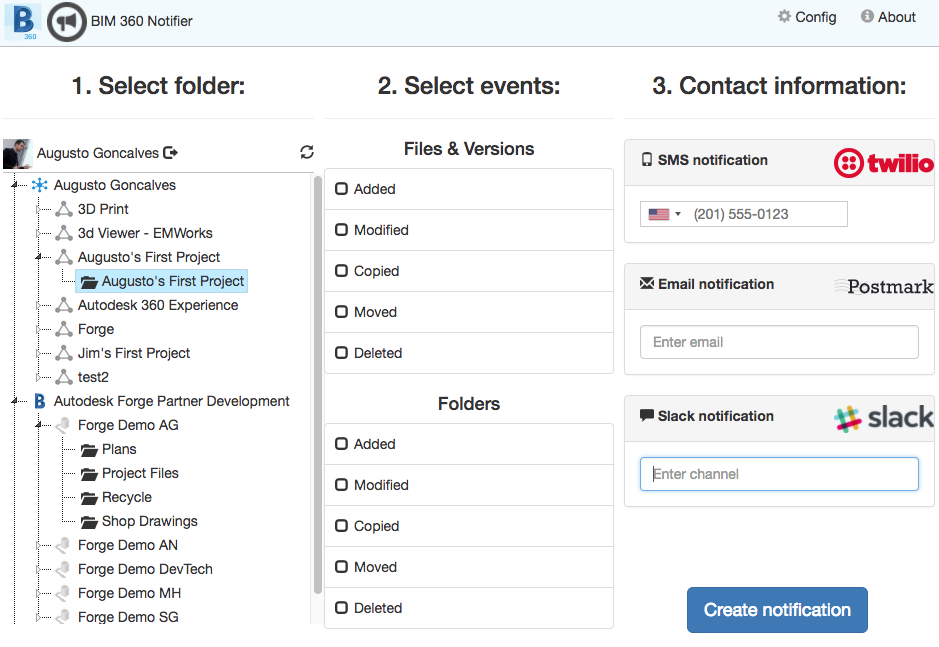
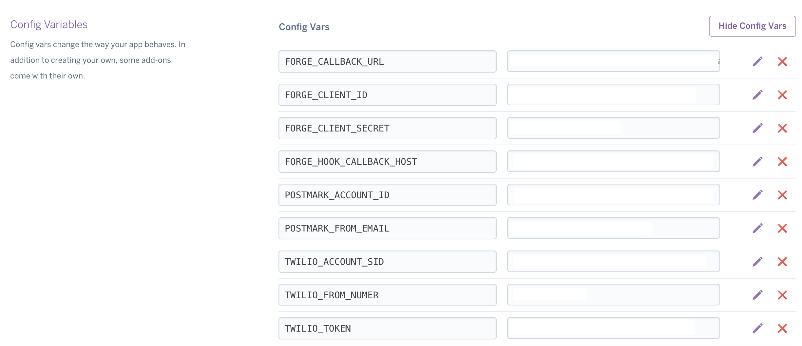

# data.management-nodejs-webhook

[](https://nodejs.org/)
[](https://www.npmjs.com/)

[](http://opensource.org/licenses/MIT)
 
 
**Forge API:** [](http://developer.autodesk.com/)
[](http://developer.autodesk.com/)
[](http://developer.autodesk.com/)

This sample application demonstrate Webhooks notifications for changes on **BIM 360 Docs**, **BIM 360 Team** (formerly A360) and **Fusion 360** to SMS, Email and chat bot.
  
## Thumbnail



## Live version

Running [live here](http://bim360notifier.autodesk.io) and [video demonstration here](https://www.youtube.com/watch?v=oZ_aNoBbpUM).

**Usage**: after sign in with your Autodesk account, (1) expand the tree to select a **folder**. Then (2), select the events to get notification. Finally, (3) enter a mobile phone number, and/or email address, and/or slack channel. Click on **Create notification**.

## Setup

## Prerequisites
This samples requires:

1. Forge credentials; 
2. Twilio account;
3. Postmark account; 
4. Slack account. 

Create the following environment variables:

### Forge

For using this sample, you need an Autodesk developer credentials. Visit the [Forge Developer Portal](https://developer.autodesk.com), sign up for an account, then [create an app](https://developer.autodesk.com/myapps/create). For this new app, use `http://localhost:3000/api/forge/callback/oauth` as Callback URL. Finally take note of the **Client ID** and **Client Secret**. For localhost testing:

- FORGE\_CLIENT\_ID and set it to above-mentioned **Client ID**
- FORGE\_CLIENT\_SECRET and set it to above-mentioned **Client Secret**
- FORGE\_CALLBACK\_URL and set it to `http://localhost:3000/api/forge/callback/oauth`

Now you need a local server to receive Webhook notifications, you can use ngrok as [described here](https://developer.autodesk.com/en/docs/webhooks/v1/tutorials/configuring-your-server/), then create a env var with the value (e.g. https://abc123.ngrok.io`)

- FORGE\_WEBHOOK\_URL

### Twilio

Create a [Twilio developer account](https://www.twilio.com). Create an phone number. Also, you will need the Account SID and Token. The following env vars are required:

- TWILIO\_ACCOUNT_SID
- TWILIO\_TOKEN
- TWILIO\_FROM\_NUMBER

### Postmark

Create a [Postmark developer account](https://postmarkapp.com). Specify the **FROM** email, verify it. Take note of your Account ID. The following env vars are required:

- POSTMARK\_ACCOUNT\_ID
- POSTMARK\_FROM\_EMAIL

### Slack

Create an app for [Slack API](https://api.slack.com/) on your company account to handle **Incoming webhooks** [see more here](https://api.slack.com/incoming-webhooks). At the UI, enter the value in the form of *T00000000/B00000000/XXXXXXXXXXXXXXXX*

## Running locally

Make sure to have [NodeJS](https://nodejs.org) installed. Clone this project or download it. It's recommended to install [GitHub desktop](https://desktop.github.com). To clone it via command line, use the following (Terminal on MacOSX/Linux, Git Shell on Windows):

```
git clone https://github.com/autodesk-forge/data.management-nodejs-webhook
```

Set all all environment variables described on the **Setup** section using the following:

- Mac OSX/Linux (Terminal)

```
export VARIABLE_NAME=value
```

- Windows (use <b>Node.js command line</b> from Start menu)

```
set VARIABLE_NAME=value
```

Install the required packaged and run the application:

```
npm install
npm run dev
```

Open the browser and go to [http://localhost:3000](http://localhost:3000).

**Important:** do not use **npm start** locally, this is intended for PRODUCTION only with HTTPS (SSL) secure cookies.

## Deployment

A deployment should have the following environment variables defined (e.g. Heroku app settings):



### Deploy on Heroku

To deploy this application to Heroku, the **Callback URL** for Forge and Storage must use your `.herokuapp.com` address. After clicking on the button below, at the Heroku Create New App page, set your Client ID, Secret and Callback URL for Forge and respective storage.

[](https://heroku.com/deploy)

Watch [this video](https://www.youtube.com/watch?v=Oqa9O20Gj0c) on how deploy samples to Heroku.

## Known issues

BIM 360 Docs Hub names are comming with wrong formating, resulting in a wrong message. This issue is under investigation.

## Tips & tricks

For local development/testing, consider use [nodemon](https://www.npmjs.com/package/nodemon) package, which auto restart your node application after any modification on your code. To install it, use:

    sudo npm install -g nodemon

Then, instead of <b>npm run dev</b>, use the following:

    npm run nodemon

Which executes <b>nodemon server.js --ignore www/</b>, where the <b>--ignore</b> parameter indicates that the app should not restart if files under <b>www</b> folder are modified.

## Troubleshooting

After installing Github desktop for Windows, on the Git Shell, if you see a ***error setting certificate verify locations*** error, use the following:

    git config --global http.sslverify "false"

## License

This sample is licensed under the terms of the [MIT License](http://opensource.org/licenses/MIT). Please see the [LICENSE](LICENSE) file for full details.


## Written by

Augusto Goncalves [@augustomaia](https://twitter.com/augustomaia), [Forge Partner Development](http://forge.autodesk.com)

### Updated By

- Denis Grigor [denis.grigor@autodesk.com](denis.grigor@autodesk.com), [Forge Partner Development](http://forge.autodesk.com)